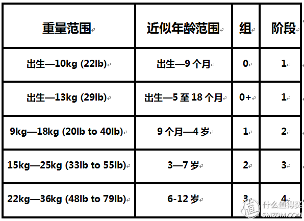

<!-- TOC -->

- [分类 Category](#分类-category)
    - [按体重范围 By weight](#按体重范围-by-weight)
    - [按安全座椅安装方向分类](#按安全座椅安装方向分类)
    - [按安全座椅安装方式分类](#按安全座椅安装方式分类)

<!-- /TOC -->

# 分类 Category

## 按体重范围 By weight

## 按安全座椅安装方向分类

后向式（背向式）、前向式、双向式、横向式 

（注：儿童面对车辆行驶方式为前向、背对车辆行驶方向为后向）

## 按安全座椅安装方式分类

安全带安装（下文如未注明的情况均为3点式安全带）、ISOFIX安装、LATCH安装
