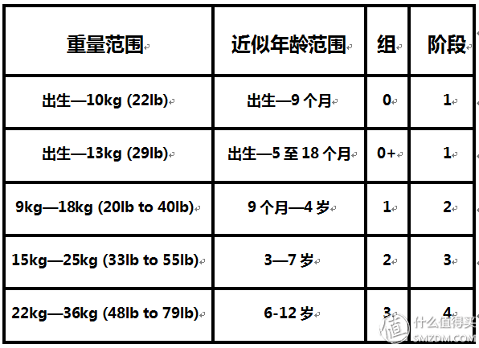
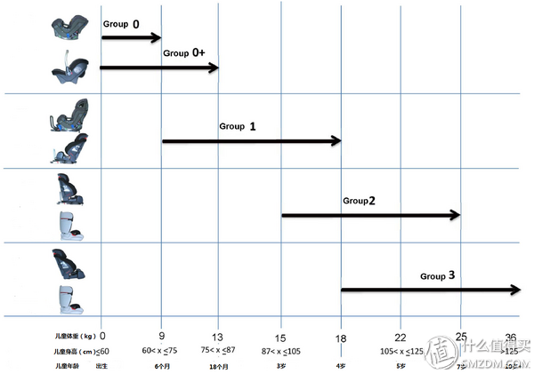
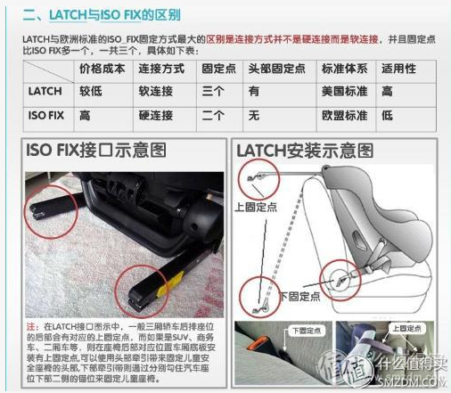
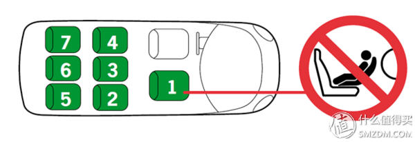
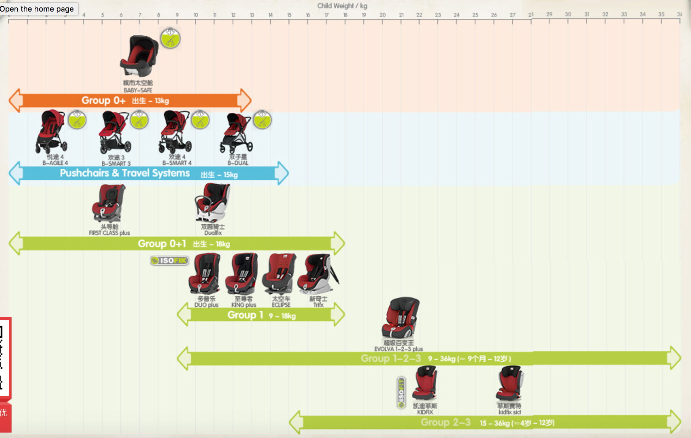

<!-- TOC -->

- [1. 分类 Category](#1-分类-category)
    - [1.1. 按体重范围 By weight](#11-按体重范围-by-weight)
    - [1.2. 按安全座椅安装方向分类](#12-按安全座椅安装方向分类)
    - [1.3. 按安全座椅安装方式分类](#13-按安全座椅安装方式分类)
- [2. 选购总原则 Guideline](#2-选购总原则-guideline)
- [3. 各组安全座椅典型举例 Analysis by groups](#3-各组安全座椅典型举例-analysis-by-groups)
    - [3.1. Group 0  Car Sleeper 安全睡篮（床）  横向安装](#31-group-0--car-sleeper-安全睡篮床--横向安装)
    - [3.2. Group 0/0+   Infant Car Seat  大家俗称的“安全提篮”](#32-group-00---infant-car-seat--大家俗称的安全提篮)
        - [3.2.1. 普通无底座（基座）型](#321-普通无底座基座型)
        - [3.2.2. 带底座型](#322-带底座型)
    - [3.3. Group 1-2-3](#33-group-1-2-3)
    - [3.4. Group 2-3 booster seat（High Back booster seat）](#34-group-2-3-booster-seathigh-back-booster-seat)
    - [3.5. Group 3 Booster Cushions（Backless Booster） 俗称“增高垫”](#35-group-3-booster-cushionsbackless-booster-俗称增高垫)
    - [3.6. Group 1或者Group 0/1  convertible seat  成长型座椅](#36-group-1或者group-01--convertible-seat--成长型座椅)
        - [3.6.1. 前向式还是后向式？](#361-前向式还是后向式)
            - [3.6.1.1. 真实案例](#3611-真实案例)
            - [3.6.1.2. 分析](#3612-分析)
            - [3.6.1.3. 关于标准 About the standard](#3613-关于标准-about-the-standard)
            - [3.6.1.4. 建议](#3614-建议)
- [4. ISOFIX v.s. LATCH](#4-isofix-vs-latch)
    - [4.1. ISOFIX (International Standards Organization FIX)](#41-isofix-international-standards-organization-fix)
        - [4.1.2. ISOFIX 儿童约束系统 ISOFIX CRS (Child Restrain System)](#412-isofix-儿童约束系统-isofix-crs-child-restrain-system)
        - [4.1.3. 通用型](#413-通用型)
        - [4.1.4. 半通用型](#414-半通用型)
    - [4.2. 美国标准 LATCH (Lower Anchors and Tethers for Children)](#42-美国标准-latch-lower-anchors-and-tethers-for-children)
- [5. 其他建议](#5-其他建议)
- [6. Britax 产品](#6-britax-产品)

<!-- /TOC -->

以下大部分内容节选自: <http://post.smzdm.com/p/36528/>

# 1. 分类 Category

## 1.1. 按体重范围 By weight

## 1.2. 按安全座椅安装方向分类

后向式（背向式）、前向式、双向式、横向式

（注：儿童面对车辆行驶方式为前向、背对车辆行驶方向为后向）

## 1.3. 按安全座椅安装方式分类

安全带安装（下文如未注明的情况均为3点式安全带）、ISOFIX安装、LATCH安装

# 2. 选购总原则 Guideline

**过于追求最高性价比对于安全座椅这个特殊产品非常不合适，有条件尽量按阶段配备安全座椅。**

以下方案均按一出生开始就使用安全座椅推荐：

* A、Group 0/0+ 安全提篮 → Group 1（后向到4岁）→ 前向Group 2-3
* B、Group 0/1（带新生儿坐垫、后向到4岁）→ 前向Group 2-3
* C、Group 0/1（带新生儿坐垫、能后向到2岁）→ 前向Group 1-2-3

# 3. 各组安全座椅典型举例 Analysis by groups

## 3.1. Group 0  Car Sleeper 安全睡篮（床）  横向安装

优点：

* 高大上！
* 婴儿（早产儿）舒服地平躺进行长途旅行、安全防护非常好（这点有争议）
* 可以与适型推车配合使用（推车还可搭配安全提篮使用）

缺点：

* 贵！
* 使用周期短（一般用到6个月）
* 使用频次低、
* 巨占车内空间（占用后排两个成人座位）

示例产品见 - <http://post.smzdm.com/p/36528#cl_2>

## 3.2. Group 0/0+   Infant Car Seat  大家俗称的“安全提篮”

### 3.2.1. 普通无底座（基座）型

使用安全带反向安装

优点：

* 安全防护好
* 轻便易于携带
* 价格相对便宜
* 可以与适型推车配合使用

缺点：

* 使用周期短（一般用到9个月，胖宝宝6个月左右就很挤了）
* 使用频次相对低
* 性价比不高
* 安装时容易出错（很容易将3点式安全带的肩带和腰带混淆安装）

### 3.2.2. 带底座型

用安全带（部分型号可用2点式安全带）、ISOFIXLATCH（部分型号只需要固定2个下锚点）安装底座，再将提篮反向安装至底座。

优点：

* 安全防护好
* 轻便易于携带
* 价格相对便宜
* 可以与适型推车配合使用
* ISOFIXLATCH安装方便、出错几率小

缺点：
* 使用周期短（能用到9个月左右就不错，胖宝宝可能6个月左右就很挤了）
* 使用频次相对低
* 性价比不高（如底座能配合适型convertible car seat使用，性价比则有所提升）

示例产品见 - <http://post.smzdm.com/p/36528#cl_3>

## 3.3. Group 1-2-3

优点：

* 使用周期长
* 使用频次高
* 性价比高
* 安装便利

缺点：

* 对9个月-4岁（或2岁）儿童的安全防护不够
* 体积较大（安装后有可能后排无法再坐下两位成人）
* 重量较重不易搬动
* 使用前置护体或车辆自带安全带对儿童进行约束，儿童可能会反感

购买建议：**不建议让小朋友在9个月时就开始使用前向式安全座椅**（具体原因后述），条件允许选择可以后向安装的Group 0/1 convertible car seat（成长型安全座椅）再过渡到Group 2-3 booster seat。

示例产品见 - <http://post.smzdm.com/p/36528#cl_4>

## 3.4. Group 2-3 booster seat（High Back booster seat）

优点：

* 对适龄儿童安全防护好
* 使用周期长
* 使用频次高
* 性价比高
* 安装便利

缺点：

* 体积较大（安装后有可能后排无法再坐下两位成人）
* 重量较重不易搬动
* 使用车辆自带安全带对儿童进行约束，儿童可能会反感

示例产品见 - <http://post.smzdm.com/p/36528#cl_5>

## 3.5. Group 3 Booster Cushions（Backless Booster） 俗称“增高垫”

优点：

* 价格便宜
* 轻便易于携带

缺点：

* 与车辆无链接（部分品牌和型号有ISOFIX/LATCH 链接）极端情况有可能从儿童身体下脱离
* 安全防护差（无侧面防护，仅靠车辆本身提供的防护）

购买建议：**一般情况下不建议购买此类产品**，条件允许还是用Group 2-3 booster seat。

示例产品见 - <http://post.smzdm.com/p/36528#cl_6>

## 3.6. Group 1或者Group 0/1  convertible seat  成长型座椅

### 3.6.1. 前向式还是后向式？

9个月-4岁的宝宝发育真可谓“突飞猛进”，体型体重变化快但由于发育不成熟，需要的保护并不比柔弱的新生儿少。一般来说 Group 0/1安全座椅的最能够展现一家儿童安全座椅生产厂商的设计、制造的水平和实力。俗语说“七坐八爬九生牙”，此时宝宝的生长发育进入一个新的阶段。按传统观念，9个月的宝宝已经可以使用前向式（面对车辆行驶方向）安全座椅。

真的是这样么？**大错特错！！！**

#### 3.6.1.1. 真实案例

一个真实的案例（一名18个月大，体重15KG的美国儿童乔尔使用前向式安全座椅的车祸经历）

* [乔尔的经历（官网）](http://www.joelsjourney.org/)
* [视频（优酷）](http://v.youku.com/v_show/id_XNjgwMzI2OTA0.html)

#### 3.6.1.2. 分析

在时速50km/h 发生前向碰撞时，坐在前向式安全座椅（5点式安全带）的宝宝的颈部负荷为180-300kg,而坐在后向式安全座椅的宝宝的颈部负荷仅为40-80kg。而3-4岁左右的宝宝，颈部能够承受的最大负荷约为130kg。

其他具体原因分析详见 - <http://post.smzdm.com/p/36528#cl_7>

#### 3.6.1.3. 关于标准 About the standard

各类标准从来都是不断更新发展的，欧洲儿童安全座椅标准ECE R44从1982年的初版到1995年03版，到2006年04版再到"**I-SIZE**"标准。"I-SIZE"（又称UN R129）是欧盟于2013年颁布的儿童安全座椅标准。"I-SIZE"标准对于ECE-R44/04标准而言，有5点重大变化：

1、**要求使用后向式安全座椅直到儿童15个月大；**

2、ISOFIX安装，减少错误安装的风险；

3、以儿童身高而不是体重来对安全座椅进行分组，以便父母更容易的选择合适的安全座椅；

4、提升安全座椅对来自前向、侧向高力度撞击的防护，着重关注儿童头部、颈部以及重要器官的保护；

5、符合i-Size标准的安全座椅可以适合安装所有符合“i-Size Ready”要求的车辆。

I-SIZE标准没有立即取代ECE-R44/04，而是在相当长的一段时间内与ECE-R44/04并行，预计会在2018年左右替代ECE-R44/04。标准会对市场、生产厂商起规范和引导作用，对此MAXI-COSI的反应最为迅速，而国人所熟知的配置前置护体的前向安全座椅的品牌：CONCORD / CYBEX / KIDDY / RECARO（STM被RECARO收购，算是子品牌）除KIDDY，都已推出在0-13KG或0-18KG阶段使用的后向安全座椅。（准确的说来自德国KIDDY最近在中国推出了一款0-4岁可以反向安装的先锋者，但至今未在其德国官网看到介绍,是否是天朝特供产品就不得而知）

#### 3.6.1.4. 建议

* **瑞典作为后向式安全座椅的发源地，更是在上世纪70年左右就已经推行使用后向式安全座椅到4岁。**

> PS：瑞典真心没有法律强制规定儿童在4岁前必须使用后向式安全座椅，但归功于政府和各类团体的宣传和引导，在瑞典父母们几乎都自觉的让儿童使用后向式安全座椅到4岁甚至更大年龄。即便想提前使用前向式安全座椅也很难，因为在瑞典国内市场几乎无法买到Group 0/1的纯前向式安全座椅。（如果把双向安装的座椅，在宝宝4岁之前就朝前使用，也会被人视为奇葩）

* **个人强烈建议给0-4岁的儿童使用后向式安全座椅，如实在无法使用后向式安全座椅到4岁，至少保证使用到2岁。**
* 强烈不建议让小朋友在9个月时就开始使用前向式安全座椅（即便配备前置护体的安全座椅对小朋友的颈部、脊柱的保护比五点式安全带的前向式座椅的要好一些，但还是远逊于后向式安全座椅）

> PS：关于前置护体和5点式安全带的争议还是留给也业内人士和大神们去搞。就目前的认知，个人不推荐儿童在2岁前使用前置护体的安全座椅。有朝一日，前置护体的安全座椅能够通过“残暴”的Swedish Plus Test，我会向大家推荐。

# 4. ISOFIX v.s. LATCH

下图是网上最常见的ISOFIX与LATCH的区别

一般的认知：安全带安装的安全座椅是所有车型通用的，ISOFIX接口的安全座椅适用于ISOFIX以及LATCH接口的车型，而LATCH接口的座椅只适用于LATCH接口的车型。真的是这样么？

## 4.1. ISOFIX (International Standards Organization FIX)

具体介绍见 - <http://post.smzdm.com/p/36528#cl_7>

结论：

* **符合2004年版的ISOFIX Standard（ISO 13216-2）或 2002版的LATCH（FMVSS225）要求的，ISOFIX和LATCH安装方式的安全座椅都是可以兼容的**（只要车型不是太老或者车厂没有无良地简配，Top teher anchorages 顶置固定点都是应该有的）
* 各位同学请回家仔细阅读家中爱车的使用说明书中涉及安全带、儿童安全座椅的章节（恐怕大多数人都没有看过...）并且认真去车内找一找“顶部锚点”吧！

### 4.1.2. ISOFIX 儿童约束系统 ISOFIX CRS (Child Restrain System)

ISOFIX儿童约束系统分

* 通用型（universal）
* 半通用型（semi universal）
* 特殊型（一般家庭用车不会涉及，这里不讲述）

### 4.1.3. 通用型

ISOFIX universal CRS 要求前向安装时是需要有两个ISOFIX接口（ISOFIX anchorages）和顶部锚点（a top tether anchorage）。

产品：

* MAXI-COSI MiloFix（双向ISOFIX安装+上拉带 、后向到13kg、正向到18kg、可配新生儿内衬）

### 4.1.4. 半通用型

ISOFIX semi universal CRS 在前向或后向安装时需要有两个ISOFIX接口（ISOFIX anchorages）和顶置锚点（a top tether anchorage）或一个支撑腿（a support leg）如需安装在配备了ISOFIX接口的副驾驶座位上，还需使用车辆仪表板作为支持。

产品：

* Cybex SIRONA（ISOFIX接口+支撑腿、后向到18kg、可配新生儿内衬）
* Britax First Class Plus 头等舱（安全带安装、后向到13kg（约2岁）、正向到18kg（约4岁）可配新生儿内衬）

## 4.2. 美国标准 LATCH (Lower Anchors and Tethers for Children)

LATCH安装两个下置锚点（Lower Anchors）时可以是像ISOFIX一样的硬质链接（Rigid），也可以是软质链接（Flexible），接头部分也是金属只是中间部分也是同安全带一样的材质。

产品：

* Britax Advocate（同系列还有MARATHON、BOULEVARD、PAVILION，2个下固定点软质链接，后向到18kg，前向到25kg）
* MAXI-COSI Pria 70（后向到18kg，可配新生儿内衬）
* Clek Foonf 2013 Convertible Child Seat（两个下固定点硬质链接，后向到22kg，前向到29kg）

LATCH安装时，如果两个下置锚点是采用硬质链接，安装便利性、稳固程度与ISOFIX是一样的，采用软质链接时效果稍差。

下图为后续讲述方便的车辆座椅位置分布示意图，不代表所有的儿童安全座椅可以安装在1-7号的位置。

LATCH软质链接其独特的优势:

1、能相对便宜的价格实现安全座椅较为简易的前后双向安装（ISOFIX 通常只做成前向或后向，可双向ISOFIX安装的安全座椅大多价格昂贵。且通常的汽车只在2、4号位置配置有ISOFIX接口，在1、3号位置配置ISOFIX接口的车辆很少）
2、在车辆允许（详见汽车说明书）以及安全座椅支持（详见说明书）的情况下，在汽车3号位没有ISOFIX接口（或LATCH下置接口）的情况采取各连接2、4号一个内侧接口的方式实现将安全座椅安装在最安全的后排中间（3号）位置。

车辆受到撞击缩溃变形凹向车体内部，拥有最大缓冲空间的位置就是后排中间。对于使用独立的儿童安全座椅的小朋友来说，如果车辆允许（详见汽车说明书）以及安全座椅支持（详见说明书）的情况下，安装在后排中间位置最为安全。

> 引用Britax的原文：The safest place for your child in anyvehicle is theback seat. The center of the rear seat is the furthest from a side impact.对小朋友来说车内最安全的座位是后排座位。后排中间的位置可有效远离侧面撞击。

# 5. 其他建议

1、不要过于迷信xxx品牌（任何品牌都有测试成绩不好或者用户口碑不好的型号），未能深入了解安全座椅发展历史和现状前也不要主观贬低，说xxx品牌就是一个笑话，到处黑。

2、辩证的看待各类推荐榜单（不同安全座椅厂家根据不同国家、地区的政策、法规要求和消费习惯，销售的产品是不同，甚至在某些国家不销售或销量很小，自然也不会送某些组织或机构检测）例如：某同学对某美国榜单看不到CONCORD和STM表示不屑一顾，实际是怎样呢？ RECARO在美国也是大牌子（而STM被RECARO收购，算是子品牌，因销售策略STM基本见不到）CONCORD进入美国市场较晚，提篮能见到，而使用前置护体的座椅很少（现行前置护体的“前世”是一种叫带“T”型盾的安全座椅，早些年在美国的实际使用记录很惨烈，所以美国消费者对待前置护体是有所忌惮的，况且美国更推荐后向到2岁）

3、仔细阅读家中爱车的使用说明书关于安全带以及儿童安全座椅的章节是否有特殊说明和要求，并实际查看你家爱车是否有ISOFIX接口、是否有top tether（顶部锚点，其实叫第三锚点更合适），后排中间是否是3点式安全带。（说明书可能是车系通用，但具体车型和车款可能简配，所以一定要实际查看）

4、在驾驶员（带宝宝出门最多的那个）调整好座位后，测量前排座椅与后排座位的空间。

5、考虑后排是否经常坐人，安全座椅是否经常需要在家中不同车辆中使用等等

6、购买安全座椅的预算范围

# 6. Britax 产品

