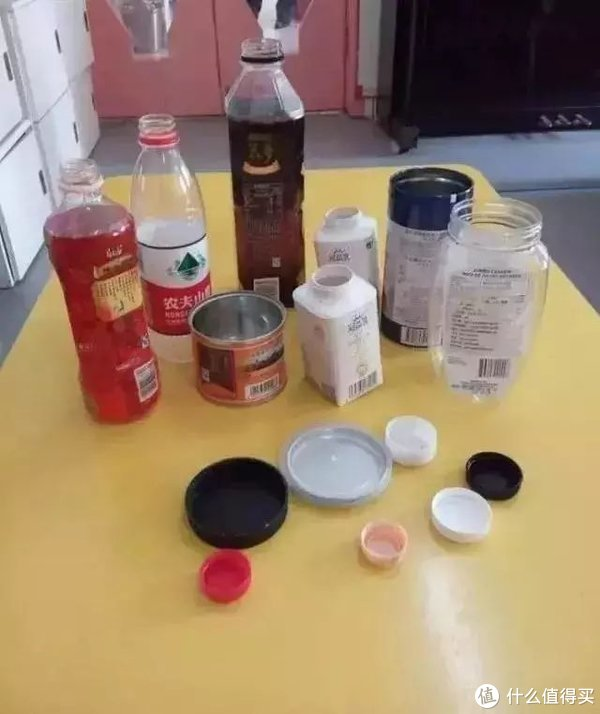
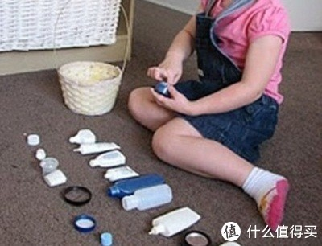
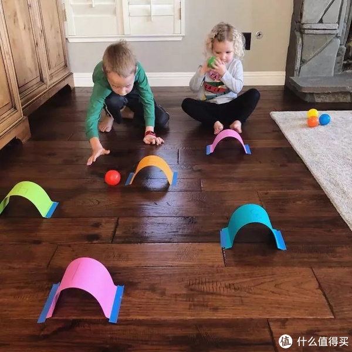

<!-- TOC -->

- [1. 一岁以下](#1-一岁以下)
    - [1.1. 十个月](#11-十个月)
- [2. 三岁](#2-三岁)
    - [2.1. 我的帽子在哪里](#21-我的帽子在哪里)
    - [2.2. 拱桥滚球游戏](#22-拱桥滚球游戏)
    - [2.3. 英语启蒙互动游戏砸蛋壳](#23-英语启蒙互动游戏砸蛋壳)
    - [2.4. 讲卫生的好游戏快来剪指甲啦](#24-讲卫生的好游戏快来剪指甲啦)

<!-- /TOC -->

# 1. 一岁以下

## 1.1. 十个月

* 百宝箱，装玩具，一个一个捡出来
* 继续听儿歌音乐，有声读物，一边玩一边播放
* 杯子下边藏东西，让宝宝自己取出来
* 锻炼靠墙独站
* 练习把玩具给妈妈
* 塑料套杯或套碗，模仿一个一个套
* 指图回答问题，比如谁在吃胡萝卜。还可以找衣服上的动物
* 反复练习拍手再见，一个人做动作，一个人把着手教

# 2. 三岁

## 2.1. 我的帽子在哪里

把家里带盖子的瓶子都收集起来，拧下盖子进行混合，让宝宝挑战快速配对。

## 2.2. 拱桥滚球游戏

在地上用纸贴出适合球大小的拱桥，就可以把普通的球玩出新花样来。可以让孩子用球穿过指定颜色的贴纸，提高难度，增加趣味，也能够帮助孩子辨别更多的颜色。

## 2.3. 英语启蒙互动游戏_砸蛋壳

[英语启蒙互动游戏_砸蛋壳.MP4](video/英语启蒙互动游戏_砸蛋壳.MP4)

## 2.4. 讲卫生的好游戏_快来剪指甲啦

[讲卫生的好游戏_快来剪指甲啦.MP4](video/讲卫生的好游戏_快来剪指甲啦.MP4)